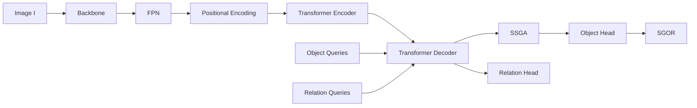

# Tài liệu Toán học Chi tiết — Mô hình OVOD + OVRD End-to-End

---

## 1. Tổng quan Pipeline



**Ký hiệu chung:**

| Ký hiệu | Ý nghĩa | Giá trị mặc định |
|----------|---------|-------------------|
| B | Batch size | 2 |
| D | Hidden dimension | 256 |
| H, W | Chiều cao/rộng feature map | Phụ thuộc backbone |
| N = H×W | Số spatial tokens | — |
| N_obj | Số object queries | 100 |
| N_rel | Số relation queries | 50 |
| C | Số lớp đối tượng | Phụ thuộc dataset |
| P | Số lớp quan hệ (predicates) | Phụ thuộc dataset |
| D_clip | Chiều CLIP embedding | 512 |

---

## 2. Backbone — Trích xuất đặc trưng đa tỷ lệ

Backbone (Swin Transformer hoặc ResNet) nhận ảnh đầu vào và trả về feature maps ở nhiều tỷ lệ:

**Đầu vào:** Ảnh `I ∈ ℝ^(B × 3 × H_img × W_img)`

**Đầu ra:** Tập feature maps đa tỷ lệ:

```
{C₃, C₄, C₅}  với  Cₖ ∈ ℝ^(B × dₖ × Hₖ × Wₖ)
```

trong đó:
- `Hₖ = H_img / 2^(k+1)`, `Wₖ = W_img / 2^(k+1)`
- `dₖ` là số channels ở level k (ví dụ Swin-Tiny: d₃=192, d₄=384, d₅=768)

---

## 3. Feature Pyramid Network (FPN)

FPN fuse thông tin đa tỷ lệ qua **lateral connections** và **top-down pathway**.

### 3.1. Lateral connections

Mỗi level được chiếu về cùng số channels D qua convolution 1×1:

```
Lₖ = Conv1×1(Cₖ)    ∈ ℝ^(B × D × Hₖ × Wₖ),   k ∈ {3, 4, 5}
```

### 3.2. Top-down pathway

Từ level cao nhất (thô nhất) đến thấp nhất (mịn nhất):

```
L₅' = L₅
L₄' = L₄ + Upsample(L₅', size=(H₄, W₄))
L₃' = L₃ + Upsample(L₄', size=(H₃, W₃))
```

`Upsample` dùng phép nội suy **bilinear**.

### 3.3. Output convolutions

```
Pₖ = Conv3×3(Lₖ')    ∈ ℝ^(B × D × Hₖ × Wₖ)
```

Cuối cùng chọn **một level** (mặc định P₅, level thô nhất) làm đầu vào cho Transformer:

```
F_src = Conv1×1(P₅)   ∈ ℝ^(B × D × H × W)
```

---

## 4. Positional Encoding — Sinusoidal 2D (DETR-style)

Cho feature map kích thước `(H, W)`, tọa độ chuẩn hóa:

```
ŷ(i,j) = (2π · i) / H,    x̂(i,j) = (2π · j) / W
```

Cho chỉ số tần số `f = 0, 1, ..., D/4 - 1` (với `D/4` cặp sin-cos mỗi trục),
tần số cơ sở:

```
ω_f = T^(2f / (D/2))      với T = 10000 (temperature)
```

Tương đương trong code: `dim_t[d] = T^(2*(d//2) / (D/2))` với `d = 0..D/2-1`,
nhưng viết theo `f` rõ ràng hơn vì mỗi `f` tạo đúng 1 cặp `(sin, cos)`.

**Encoding theo trục X** (D/4 cặp sin-cos):

```
PE_x(i, j, 2f)   = sin(x̂(i,j) / ω_f)
PE_x(i, j, 2f+1) = cos(x̂(i,j) / ω_f)
```

**Encoding theo trục Y** (D/4 cặp sin-cos, tương tự):

```
PE_y(i, j, 2f)   = sin(ŷ(i,j) / ω_f)
PE_y(i, j, 2f+1) = cos(ŷ(i,j) / ω_f)
```

**Kết hợp:**

```
PE(i, j) = [PE_y(i,j); PE_x(i,j)]   ∈ ℝ^D
```

**Mapping sang code** (`position_encoding.py`):
```
dim_t = torch.arange(D/2)           # d = 0..D/2-1
ω     = T^(2*(d//2) / (D/2))        # f = d//2 → mỗi f dùng cho 1 sin + 1 cos
pos_x = x̂[:,:,:,None] / ω          # (B, H, W, D/2)
→ stack(sin(pos_x[...,0::2]), cos(pos_x[...,1::2]))  → flatten → (B, H, W, D/2)
```

Toàn bộ: `PE ∈ ℝ^(B × D × H × W)` — **không có tham số học**, tự thích ứng mọi resolution.

---

## 5. Transformer Encoder

### 5.1. Chuẩn bị đầu vào

Flatten feature map thành chuỗi tokens:

```
S = Flatten(F_src) + Flatten(PE)    ∈ ℝ^(B × N × D),   N = H × W
```

### 5.2. Self-Attention Layer

Mỗi encoder layer gồm **Multi-Head Self-Attention (MHSA)** + **Feed-Forward Network (FFN)**.

**Multi-Head Self-Attention:**

Cho input `X ∈ ℝ^(B × N × D)` và `h` heads với `dₕ = D/h`:

```
Qᵢ = X · W_Q^i,   Kᵢ = X · W_K^i,   Vᵢ = X · W_V^i     ∈ ℝ^(B × N × dₕ)
```

```
Attention(Qᵢ, Kᵢ, Vᵢ) = softmax(Qᵢ · Kᵢᵀ / √dₕ) · Vᵢ
```

```
MHSA(X) = Concat(head₁, ..., headₕ) · W_O
```

**Feed-Forward Network:**

```
FFN(x) = ReLU(x · W₁ + b₁) · W₂ + b₂
```

với `W₁ ∈ ℝ^(D × D_ff)`, `W₂ ∈ ℝ^(D_ff × D)`, `D_ff = 1024`.

**Encoder layer (Pre-LN):**

```
X' = X + Dropout(MHSA(LayerNorm(X)))
X'' = X' + Dropout(FFN(LayerNorm(X')))
```

Stack `L_enc = 6` layers → Output: **Memory** `M ∈ ℝ^(B × N × D)`.

---

## 6. Transformer Decoder

### 6.1. Learnable Queries

```
q_obj = Embedding(N_obj, D)    — Object queries
q_rel = Embedding(N_rel, D)    — Relation queries
q = [q_obj; q_rel]  ∈ ℝ^(B × (N_obj + N_rel) × D)
```

Target khởi tạo zero: `tgt = 0 + q`

### 6.2. Decoder Layer

Mỗi decoder layer gồm:
1. **Self-Attention** giữa các queries
2. **Cross-Attention** queries → memory (encoder output)
3. **FFN**

```
tgt' = tgt + Dropout(SelfAttn(tgt))
tgt'' = tgt' + Dropout(CrossAttn(tgt', M))
tgt''' = tgt'' + Dropout(FFN(tgt''))
```

**Cross-Attention:**

```
Q = tgt' · W_Q,    K = M · W_K,    V = M · W_V
CrossAttn = softmax(Q · Kᵀ / √dₕ) · V
```

### 6.3. Intermediate Outputs (Deep Supervision)

Decoder trả output **từ mỗi layer** `l = 1, ..., L_dec`:

```
hs = [hs⁽¹⁾, hs⁽²⁾, ..., hs⁽ᴸ⁾]    ∈ ℝ^(L_dec × B × (N_obj+N_rel) × D)
```

Split thành:

```
O⁽ˡ⁾ = hs⁽ˡ⁾[:, :N_obj, :]     ∈ ℝ^(B × N_obj × D)    — Object features
R⁽ˡ⁾ = hs⁽ˡ⁾[:, N_obj:, :]     ∈ ℝ^(B × N_rel × D)    — Relation features
```

---

## 7. Relation Head — Predicate Classification & Pointer

### 7.1. Predicate Classification

**Closed-vocabulary:** `p = R · W_pred + b_pred   ∈ ℝ^(B × N_rel × (P+1))`

**Open-vocabulary:** `p = R · W_pred   ∈ ℝ^(B × N_rel × D_clip)`

### 7.2. Subject/Object Pointer (Scaled Dot-Product)

Mỗi relation query "trỏ" vào object query nào là subject, object nào là object:

```
s_q = R · W_sub    ∈ ℝ^(B × N_rel × D)
o_q = R · W_obj    ∈ ℝ^(B × N_rel × D)
```

```
A_sub = (s_q · Oᵀ) / √D    ∈ ℝ^(B × N_rel × N_obj)
A_obj = (o_q · Oᵀ) / √D    ∈ ℝ^(B × N_rel × N_obj)
```

Xác suất subject/object: `P_sub = softmax(A_sub)`, `P_obj = softmax(A_obj)`

---

## 8. SSGA — Sparse Scene-Graph-Guided Attention

### 8.1. Xây dựng ma trận adjacency thưa

Từ `A_sub, A_obj`, xây dựng mask `M_adj ∈ {0,1}^(B × N_obj × N_rel)`:

```
TopK_sub(j) = top-k indices of A_sub[:, j, :]   — k subject candidates cho relation j
TopK_obj(j) = top-k indices of A_obj[:, j, :]   — k object candidates cho relation j
```

```
M_adj[b, i, j] = 1   nếu i ∈ TopK_sub(j) ∪ TopK_obj(j)
M_adj[b, i, j] = 0   ngược lại
```

### 8.2. Sparse Multi-Head Attention

```
Q = O · W_Q^ssga,    K = R · W_K^ssga,    V = R · W_V^ssga
```

Attention score cho head h:

```
Ã_h(i,j) = (Q_h[i] · K_h[j]ᵀ) / √dₕ
```

Áp dụng sparse mask:

```
        ⎧ Ã_h(i,j)    nếu M_adj[b,i,j] = 1
Â_h(i,j) = ⎨
        ⎩ -∞         nếu M_adj[b,i,j] = 0
```

```
α_h = softmax(Â_h, dim=-1)    — chỉ attend đến relations liên quan
```

```
SSGA_output = Concat(α₁V₁, ..., αₕVₕ) · W_O^ssga
```

**Residual + LayerNorm:**

```
O' = LayerNorm(O + Dropout(SSGA_output))
```

---

## 9. Object Head — Bounding Box & Classification

### 9.1. Bounding Box Regression (MLP)

```
b̂ = σ(MLP_box(O'))    ∈ ℝ^(B × N_obj × 4)
```

```
MLP_box: D → D → D → 4  (ReLU activations, Sigmoid ở output)
```

Output `b̂ = (ĉx, ĉy, ŵ, ĥ)` chuẩn hóa `[0, 1]`.

### 9.2. Classification

**Closed-vocabulary:**

```
ĉ = O' · W_cls + b_cls    ∈ ℝ^(B × N_obj × (C+1))
```

Lớp cuối cùng `(C+1)` là "no object" (∅).

**Open-vocabulary:**

```
ê = O' · W_emb    ∈ ℝ^(B × N_obj × D_clip)
```

Classification qua cosine similarity với text embeddings (xem mục 11):

```
ĉ(i, c) = cos(ê_i, t_c) / τ
```

### 9.3. Learnable Temperature

```
τ = exp(log_τ)     — log_τ là tham số học, khởi tạo ln(100) ≈ 4.6052
```

---

## 10. SGOR — Scene-Graph-Based Offset Regression

### 10.1. Inverse-Sigmoid Parameterisation

Để đảm bảo ổn định số học khi refine boxes ở không gian `[0,1]`:

```
σ⁻¹(x) = ln(x / (1 - x))      — inverse sigmoid
```

### 10.2. Offset Prediction

```
b_inv = σ⁻¹(b̂.detach())                     — detach để tránh gradient through boxes
z = [O'; b_inv]                               — concatenate features + box coords
Δb = MLP_sgor(z)    ∈ ℝ^(B × N_obj × 4)     — predicted offsets
```

```
MLP_sgor: (D+4) → 256 → 256 → 4  (ReLU, zero-init last layer)
```

### 10.3. Box Refinement

```
b̂_refined = σ(σ⁻¹(b̂) + Δb)
```

Zero-init đảm bảo `Δb ≈ 0` ban đầu → `b̂_refined ≈ b̂`, giúp training ổn định.

---

## 11. CLIP Text Encoder & Gradient Flow

### 11.1. Text Encoding

Cho tập tên lớp `{name₁, ..., nameC}`, tạo prompts:

```
prompt_c = "a photo of a {name_c}"
```

Encode qua CLIP text encoder (frozen):

```
t_c = normalize(CLIP_text(prompt_c))    ∈ ℝ^D_clip
```

### 11.2. Open-Vocabulary Inference

```
score(i, c) = cos(ê_i, t_c) / τ = (ê_i · t_c) / (‖ê_i‖ · ‖t_c‖ · τ)
```

```
ŷ_i = argmax_c  score(i, c)
```

**Predicate text embeddings:**

CLIP text encoder được huấn luyện trên dataset image-text pairs (thường là câu mô tả).
Nó không quen với cú pháp phi tự nhiên như `"a relation of {name}"`. Do đó, thay vì 1 prompt
kém hiệu quả, ta dùng **ensemble của 3 templates**:

1. Dạng từ nguyên thể (bare word): `"{name}"` (vd: "riding")
2. Dạng động từ: `"a person {name} something"`
3. Dạng quan hệ không gian/hành động chung: `"something {name} something"`

```
t_p_1 = CLIP("{name}")
t_p_2 = CLIP("a person {name} something")
t_p_3 = CLIP("something {name} something")

t_p = normalize((t_p_1 + t_p_2 + t_p_3) / 3)   ∈ ℝ^D_clip
```

Quá trình trung bình hóa (average ensemble) và re-normalize này giúp text embedding của predicate `t_p` robust và align sát với visual features hơn.

### 11.3. CLIP Frozen Strategy & Gradient Flow

CLIP text encoder được **frozen hoàn toàn** — tất cả tham số có `requires_grad = False`:

```
∀ θ ∈ Θ_CLIP :  ∂L/∂θ = 0   (không cập nhật)
```

CLIP **không được đăng ký** như submodule của mô hình chính (`nn.Module`), do đó:
- Tham số CLIP **không xuất hiện** trong `model.parameters()` hay `state_dict()`
- Checkpoint chỉ chứa visual backbone + transformer + heads (~14M params thay vì ~165M)

Điều này có nghĩa gradient flow cho nhánh open-vocabulary là:

```
L_vl → ∂L/∂ê_i → ∂ê_i/∂W_emb → ∂W_emb/∂O' → ... → backbone
              ↓
           t_c = const  (frozen, no gradient)
```

Chỉ **projection layer** `W_emb ∈ ℝ^(D × D_clip)` trong ObjectHead/RelationHead được cập nhật.
Text embeddings `t_c` là **hằng số** trong suốt quá trình training.

### 11.4. Lý do Frozen CLIP

| Chiến lược | Ưu điểm | Nhược điểm |
|------------|---------|------------|
| **Frozen hoàn toàn** (hiện tại) | Giữ nguyên zero-shot generalization, nhẹ VRAM | Không adapt được vào domain cụ thể |
| Fine-tune text projection | Cải thiện alignment | Có thể mất generalization |
| LoRA / Adapter CLIP | Cân bằng adaptation vs generalization | Phức tạp hơn |

### 11.5. Impact lên Training

Vì `t_c` cố định, InfoNCE loss chỉ điều chỉnh **visual embedding space**:

```
∂L_vl/∂W_emb = (1/τ) · Σᵢ (ê_i - t_{c_i}) · O'ᵢᵀ   (simplified)
```

Điều này buộc `W_emb` học phép chiếu sao cho visual features align với CLIP text space —
tương đương **knowledge distillation** từ CLIP text encoder sang visual encoder.

---

## 12. Hungarian Matching

### 12.1. Object Matching

Cho `N_obj` predictions và `M` ground-truth boxes, tìm **song ánh tối ưu** `σ*`:

```
σ* = argmin_σ  Σᵢ  C_match(ŷ_σ(i), yᵢ)
```

**Cost matrix** `C ∈ ℝ^(N_obj × M)`:

```
C(i, j) = λ_cls · C_cls(i,j) + λ_box · C_box(i,j) + λ_giou · C_giou(i,j)
```

Với **Focal Loss cost** (sigmoid mode):

```
C_cls^focal(i, j) = α · (1-p̂ᵢⱼ)^γ · (-log(p̂ᵢⱼ))         — positive cost
                   + (1-α) · p̂ᵢⱼ^γ · (-log(1-p̂ᵢⱼ))       — negative cost
```

với `p̂ᵢⱼ = σ(ĉᵢ)[class_j]`.

```
C_box(i, j) = ‖b̂ᵢ - bⱼ‖₁                          (cxcywh, không cần convert)
C_giou(i, j) = -GIoU(xyxy(b̂ᵢ), xyxy(bⱼ))          (phải convert cxcywh → xyxy trước)
```

> **Lưu ý:** Giống như L_giou (§13.3), C_giou trong matcher cũng yêu cầu
> `box_cxcywh_to_xyxy()` trước khi gọi `generalized_box_iou()`. Trong code đã
> thực hiện ở `HungarianMatcher.forward()` dòng 116-118.

Giải bằng **thuật toán Hungarian** (scipy `linear_sum_assignment`) — O(n³).

### 12.2. Relation Matching

Tương tự, cho `N_rel` relation queries và `R` ground-truth relations `(s_r, o_r, p_r)`.

**Điều kiện tiên quyết — per-relation filtering:**

Khi `N_obj < N_gt` (ví dụ ảnh có 120 GT objects nhưng chỉ 100 queries),
một số GT objects sẽ **không có prediction match**. Khi đó `s_σ(r)` hoặc `o_σ(r)` không xác định.

Giải pháp: **chỉ giữ lại** các GT relations mà **cả subject VÀ object đều đã được matched**:

```
R_valid = { r ∈ R_gt  |  tgt_to_pred[s_r] ≥ 0  AND  tgt_to_pred[o_r] ≥ 0 }
```

Các relations có subject hoặc object chưa matched sẽ bị **bỏ qua** (không tính loss),
thay vì skip toàn bộ ảnh — cho phép ảnh vẫn đóng góp các relations hợp lệ.

**Edge case:** Nếu `R_valid = ∅` (không có relation nào có cả subject và object matched),
thì `L_rel` của ảnh đó = 0 và ảnh không đóng góp vào `N_matched`. Điều này tránh chia cho 0.

**Cost matrix** cho các valid relations:

```
C_rel(q, r) = -log P_pred(q, p_r) - log P_sub(q, s_σ(r)) - log P_obj(q, o_σ(r))
```

trong đó `s_σ(r)` là prediction index tương ứng GT subject index `s_r` (từ object matching).

---

## 13. Loss Functions

### 13.1. Sigmoid Focal Loss — `L_cls`

```
FL(pₜ) = -αₜ · (1 - pₜ)^γ · log(pₜ)
```

trong đó:
- `pₜ = p` nếu y=1, `pₜ = 1-p` nếu y=0
- `p = σ(z)` (sigmoid)
- `αₜ = α` nếu y=1, `αₜ = 1-α` nếu y=0
- `α = 0.25`, `γ = 2.0` (mặc định)

```
L_cls = (1/N_boxes) · Σᵢ Σ_c FL(p̂ᵢ,c, yᵢ,c)
```

### 13.2. Bounding Box L1 Loss — `L_bbox`

L1 loss được tính **trực tiếp trong không gian cxcywh** (không cần convert):

```
L_bbox = (1/N_boxes) · Σᵢ ‖b̂_σ(i) - bᵢ‖₁
```

trong đó `b̂, b ∈ [0,1]⁴` đều ở format `(cx, cy, w, h)` chuẩn hóa.

### 13.3. Generalized IoU Loss — `L_giou`

**Bước chuyển đổi bắt buộc:** GIoU yêu cầu format `(x₁, y₁, x₂, y₂)` (xyxy).
Trước khi tính, convert từ cxcywh → xyxy:

```
x₁ = cx - w/2,   y₁ = cy - h/2
x₂ = cx + w/2,   y₂ = cy + h/2
```

Trong code: `box_cxcywh_to_xyxy(b̂)` được gọi **trước khi truyền vào** `generalized_box_iou()`.

Sau đó:

```
IoU(A, B) = |A ∩ B| / |A ∪ B|
GIoU(A, B) = IoU(A, B) - (|C \ (A ∪ B)|) / |C|
```

với `C` là smallest enclosing box, `A, B` ở format xyxy.

```
L_giou = (1/N_boxes) · Σᵢ (1 - GIoU(xyxy(b̂_σ(i)), xyxy(bᵢ)))
```

> **Lưu ý quan trọng:** L_bbox dùng cxcywh, L_giou dùng xyxy. Đây là thiết kế có chủ đích:
> L1 không phụ thuộc format, nhưng IoU yêu cầu tọa độ corner.

### 13.4. Relation Losses — `L_rel`

Sau relation matching `(q_k ↔ r_k)`:

**Predicate CE:**

```
L_pred = Σ_k CE(ĉ_pred[q_k], p_{r_k})
```

**Pointer CE:**

```
L_ptr = Σ_k [CE(A_sub[q_k], s_σ(r_k)) + CE(A_obj[q_k], o_σ(r_k))]
```

**Tổng hợp:**

```
L_rel = (L_pred + L_ptr) / N_matched
```

### 13.5. Vision-Language Contrastive Loss — `L_vl`

**Chiến lược negatives: All-Class Negatives** (không phải in-batch).

Vấn đề: In-batch InfoNCE truyền thống dùng M matched pairs làm negatives cho nhau.
Với `B=2`, `M` rất nhỏ → ít negatives → contrastive learning kém hiệu quả.

Giải pháp: Mỗi visual embedding được so sánh với **toàn bộ C text embeddings** của tất cả classes,
không chỉ các GT classes trong batch:

```
L_vl = -(1/M) · Σᵢ log [exp(cos(ê_i, t_{c_i}) / τ) / Σ_{c=1}^{C} exp(cos(ê_i, t_c) / τ)]
```

trong đó:
- `ê_i ∈ ℝ^D_clip` — visual embedding (L2-normalized) của prediction thứ i
- `t_c ∈ ℝ^D_clip` — text embedding (L2-normalized, frozen) của class c
- `c_i` — GT class label của prediction i (positive)
- Mẫu số chạy qua **tất cả C classes** → luôn có C negatives
- `τ = exp(log_τ)` — learnable temperature

**Xác nhận: L_vl là asymmetric (chỉ Image→Text, không có Text→Image).**

Phiên bản cũ dùng symmetric InfoNCE `(L_i2t + L_t2i) / 2` với ma trận M×M.
Phiên bản hiện tại chuyển sang **all-class negatives** với ma trận M×C, do đó:
- `L_i2t`: mỗi visual embed → classify vào 1 trong C classes → **có ý nghĩa**
- `L_t2i`: mỗi text embed → classify vào 1 trong M visual embeds → **không hợp lý**
  (vì M thay đổi mỗi batch, và nhiều visual embeds có thể cùng class)

Vì vậy chỉ giữ `L_i2t`, tương đương cross-entropy classification trong CLIP embedding space.

**So sánh chiến lược:**

| Chiến lược | Số negatives | Symmetric? | Ưu/nhược |
|------------|-------------|------------|----------|
| In-batch symmetric (cũ) | M-1 (≈ 2-4) | Có | Quá ít negatives, gradient yếu |
| **All-class asymmetric (hiện tại)** | C-1 (≈ 80-1000+) | Không | Đủ mạnh, đơn giản, không cần memory bank |
| Memory bank / MoCo | Configurable (65536) | Có | Phức tạp, cần queue management |

**Lưu ý:** `L_vl` chỉ active khi `dim(pred_logits) == dim(text_embed)` (open-vocab mode).
Trong closed-vocab mode (pred_logits = num_classes+1), `L_vl = 0`.

### 13.6. Predicate Vision-Language Contrastive Loss — `L_vl_pred`

**Tương tự L_vl nhưng cho nhánh relation (predicate embeddings).**

Trong open-vocab mode, `rel_logits ∈ ℝ^(B × N_rel × D_clip)` là predicate embeddings.
Mỗi matched predicate embedding được so sánh với **toàn bộ P predicate text embeddings**:

```
L_vl_pred = -(1/K) · Σ_q log [exp(cos(p_q, t_{p_r}) / τ_rel) / Σ_{p=1}^{P} exp(cos(p_q, t_p) / τ_rel)]
```

trong đó:
- `p_q ∈ ℝ^D_clip` — predicate embedding (L2-normalized) của relation query q
- `t_p ∈ ℝ^D_clip` — predicate text embedding (frozen, từ prompt ensemble) của predicate p
- `p_r` — GT predicate label của relation r (positive)
- `τ_rel = exp(log_τ_rel)` — learnable temperature riêng cho RelationHead
- K = số matched relation queries

**Tại sao cần L_vl_pred (không chỉ L_rel)?**

Nếu chỉ dùng `L_rel = CE(ĉ_pred, p_r)` (closed-vocab CE), `W_pred` học phân loại
trên tập cố định P predicates. Khi chuyển sang open-vocab, `W_pred` output `D_clip`
embeddings nhưng **không có signal nào buộc chúng align với CLIP text space** → novel
predicates sẽ không hoạt động.

`L_vl_pred` đóng vai trò **knowledge distillation** từ CLIP text encoder sang
predicate visual encoder, tương tự `L_vl` cho objects.

**Predicate Prompt Ensemble:**

CLIP không được train với "a relation of X" → dùng ensemble 3 templates:

```
t_p = normalize(mean(
    CLIP("riding"),                      # bare word
    CLIP("a person riding something"),    # verb context  
    CLIP("something riding something"),   # generic context
))
```

Average rồi re-normalize → robust hơn single template.

**Lưu ý:** `L_vl_pred` chỉ active trong open-vocab mode
(`dim(rel_logits) == dim(pred_text_embed)`). Closed-vocab → `L_vl_pred = 0`.

### 13.7. Auxiliary Deep Supervision Loss

Cho mỗi intermediate decoder layer `l`:

```
L_aux^(l) = L_cls^(l) + L_bbox^(l) + L_giou^(l) + L_rel^(l) + L_vl^(l) + L_vl_pred^(l)
```

### 13.8. Tổng Loss

```
L_total = λ_cls · L_cls + λ_bbox · L_bbox + λ_giou · L_giou
        + λ_rel · L_rel + λ_vl · L_vl + λ_vl_pred · L_vl_pred
        + Σ_l (auxiliary losses with same weights)
```

**Trọng số mặc định:**

| Ký hiệu | Giá trị | Ý nghĩa |
|----------|---------|---------|
| λ_cls | 1.0 | Classification (Focal) |
| λ_bbox | 5.0 | L1 bounding box |
| λ_giou | 2.0 | Generalized IoU |
| λ_rel | 1.0 | Relation detection (closed-vocab) |
| λ_vl | 1.0 | Object VL alignment |
| **λ_vl_pred** | **1.0** | **Predicate VL alignment (NEW)** |

---

## 14. Evaluation Metrics

### 14.1. Mean Average Precision (mAP@0.5)

Cho mỗi lớp `c`, sắp xếp predictions theo confidence score giảm dần:

```
Precision(k) = TP(k) / (TP(k) + FP(k))
Recall(k) = TP(k) / N_gt^c
```

```
AP_c = Σ_k Precision(k) · max(0, Recall(k) - Recall(k-1))
```

```
mAP = (1/C_pos) · Σ_c AP_c     — C_pos = số lớp có ít nhất 1 GT
```

TP: IoU ≥ 0.5 và chưa matched trước đó.

### 14.2. Recall@K cho Relation Detection

Cho top-K predicted triplets (s, p, o), score mỗi triplet:

**Closed-vocab mode** (num_rel_predicates > 0):

```
P_pred(q, p) = softmax(ĉ_pred[q])[p]     — softmax trên tập cố định P+1 classes
score(q) = P_pred(q, p̂) · P_sub(q, ŝ) · P_obj(q, ô)
```

**Open-vocab mode** (predicate embeddings ∈ ℝ^D_clip):

```
sim(q, p) = cos(p_q, t_p) / τ_rel          — cosine similarity vs CLIP text embed
P_pred(q, p) = softmax_p(sim(q, ·))[p]     — softmax trên TẤT CẢ P predicate text embeds
score(q) = P_pred(q, p̂) · P_sub(q, ŝ) · P_obj(q, ô)
```

trong đó:
- `p_q` — L2-normalized predicate embedding từ RelationHead
- `t_p` — L2-normalized CLIP text embed (từ prompt ensemble) của predicate p
- `τ_rel` — learnable temperature từ RelationHead

> **Novel predicates:** Trong open-vocab, có thể thêm predicate mới bất kỳ
> bằng cách thêm `t_p_new = CLIP_encode("new_predicate")` vào tập text embeddings.
> Score sẽ được tính tự động mà **không cần retrain**.

GT relation `(s_gt, p_gt, o_gt)` được matched nếu tồn tại predicted triplet `(ŝ, p̂, ô)` sao cho:

```
p̂ = p_gt   AND   IoU(box_ŝ, box_s_gt) ≥ 0.5   AND   IoU(box_ô, box_o_gt) ≥ 0.5
```

```
R@K = N_matched / N_total_gt_relations
```

---

## 15. Weight Initialization Strategy

Mỗi module sử dụng chiến lược khởi tạo khác nhau, được chọn dựa trên activation function và vai trò:

### 15.1. Transformer (Encoder + Decoder)

**Xavier Uniform** cho tất cả weight matrices có `dim > 1`:

```
W ~ U(-a, a),   a = gain · √(6 / (fan_in + fan_out))
```

Với `gain = 1.0` (linear/sigmoid). Áp dụng cho:
- `W_Q, W_K, W_V, W_O` (attention projections)
- `W₁, W₂` (FFN layers)
- Tất cả bias khởi tạo = 0

**Lý do**: Xavier duy trì phương sai đầu ra ≈ phương sai đầu vào qua mỗi layer,
phù hợp với attention (không có ReLU trực tiếp trên Q, K, V).

### 15.2. FPN Convolutions

**Kaiming Uniform** (He initialization):

```
W ~ U(-b, b),   b = √(6 / ((1 + a²) · fan_in)),   a = 1 (negative slope)
```

Bias = 0. Áp dụng cho:
- `Conv1×1` (lateral connections)
- `Conv3×3` (output convolutions)

**Lý do**: FPN output qua ReLU-like downstream processing → Kaiming giữ tín hiệu ổn định.

### 15.3. SGOR — Zero Initialization

Layer cuối cùng của MLP được khởi tạo **zero**:

```
W_last = 0,   b_last = 0
```

Điều này đảm bảo:
```
Δb = MLP(z) ≈ 0  khi bắt đầu training → b̂_refined ≈ b̂
```

Mô hình bắt đầu từ identity refinement, tránh phá vỡ box predictions ở giai đoạn đầu.

### 15.4. Prediction Heads (ObjectHead, RelationHead)

**Default PyTorch Linear init** (Kaiming Uniform):

```
W ~ U(-1/√fan_in, 1/√fan_in)
```

**Learnable temperature** `log_τ`:
```
log_τ = ln(100) ≈ 4.6052   →   τ = exp(log_τ) ≈ 100   →   1/τ ≈ 0.01
```

Khởi tạo 1/τ nhỏ → cosine similarity scores ban đầu ≈ 0 → softmax uniform → gradient lớn → học nhanh ở giai đoạn đầu.

### 15.5. Learnable Query Embeddings

```
q_obj, q_rel ~ N(0, 1)   (default nn.Embedding init)
```

### 15.6. Backbone (Swin / ResNet)

Sử dụng **pretrained weights** từ ImageNet (qua `timm`).
Khi `pretrained=True`, không áp dụng random init — dùng nguyên weights đã train.

### 15.7. Bảng tổng hợp

| Module | Init Strategy | Activation liên quan |
|--------|--------------|---------------------|
| Transformer W_Q, W_K, W_V, W_O | Xavier Uniform | Softmax |
| Transformer FFN W₁, W₂ | Xavier Uniform | ReLU |
| FPN Conv1×1, Conv3×3 | Kaiming Uniform (a=1) | ReLU downstream |
| ObjectHead MLP | Default (Kaiming) | ReLU + Sigmoid |
| SGOR last layer | **Zero** | Identity ban đầu |
| Temperature log_τ | Constant ln(100) | exp() |
| Query Embeddings | Normal(0,1) | — |
| Backbone | ImageNet pretrained | — |

---

## 16. Optimizer & Learning Rate Schedule

### 16.1. Optimizer — AdamW

```
θ_{t+1} = θ_t - η · (m̂_t / (√v̂_t + ε) + λ · θ_t)
```

trong đó:
- `m̂_t = m_t / (1 - β₁ᵗ)` — bias-corrected first moment
- `v̂_t = v_t / (1 - β₂ᵗ)` — bias-corrected second moment
- `β₁ = 0.9, β₂ = 0.999, ε = 1e-8` (PyTorch defaults)
- `λ` = weight decay (decoupled, không qua gradient)

**Hyperparameters mặc định:**

| Tham số | Giá trị |
|---------|---------|
| Base learning rate η | 1e-4 |
| Weight decay λ | 1e-4 |
| β₁, β₂ | 0.9, 0.999 |

### 16.2. Per-Group Learning Rates

Các nhóm tham số có learning rate khác nhau để tránh phá pretrained weights:

```
Group 1 (Backbone):     η_bb = η × 0.1 = 1e-5
Group 2 (Transformer):  η_tf = η       = 1e-4
Group 3 (Heads/SSGA):   η_hd = η       = 1e-4
```

**Lý do**: Backbone đã pretrained trên ImageNet → cần LR nhỏ hơn
để fine-tune nhẹ thay vì phá vỡ features đã học.

Trong code, cụ thể:
```
param_groups = [
    {"params": backbone_params,  "lr": η × 0.1},
    {"params": other_params,     "lr": η},
]
```

### 16.3. Learning Rate Schedule — StepLR

```
η(epoch) = η₀ · γ^⌊epoch / step_size⌋
```

Với:
- `η₀ = 1e-4` (initial LR)
- `γ = 0.1` (decay factor)
- `step_size = 40` epochs

Nghĩa là:
```
Epoch  0–39:  η = 1e-4
Epoch 40–49:  η = 1e-5
```

### 16.4. Gradient Clipping

```
if ‖∇L‖₂ > max_norm:
    ∇L ← ∇L · (max_norm / ‖∇L‖₂)
```

Với `max_norm = 0.1` (DETR default). Ngăn gradient explosion trong Transformer,
đặc biệt ở giai đoạn đầu khi attention chưa hội tụ.

### 16.5. Gradient Flow Diagram

```
L_total
  ├── L_cls ──→ ObjectHead.W_cls ──→ SSGA ──→ Decoder ──→ Encoder ──→ FPN ──→ Backbone
  ├── L_bbox ─→ ObjectHead.MLP_box ─┘           │
  ├── L_giou ─→ ObjectHead.MLP_box ─┘           │
  ├── L_rel ──→ RelationHead.W_pred ─────────────┘
  │            RelationHead.W_sub ──→ ObjectHead (via pointer attn)
  │            RelationHead.W_obj ──→ ObjectHead (via pointer attn)
  ├── L_vl ──→ ObjectHead.W_emb ──→ SSGA ──→ Decoder ──→ ... ──→ Backbone
  │           t_c = CLIP(frozen) ← NO GRADIENT
  └── SGOR.MLP ──→ detach(b̂) ← NO GRADIENT through initial boxes
                   gradient chỉ qua obj_features, không qua bbox predictions trước đó
```

---

## 17. Bảng tóm tắt toàn bộ công thức

| Module | Công thức chính | Init | Tham số |
|--------|----------------|------|---------|
| FPN | `Pₖ = Conv3×3(Lₖ + Up(Lₖ₊₁))` | Kaiming | Conv1×1, Conv3×3 |
| Pos Encoding | `PE = [sin/cos(ŷ/ωd); sin/cos(x̂/ωd)]` | — | Không có tham số |
| Encoder | `MHSA + FFN × L_enc` | Xavier | W_Q, W_K, W_V, W_O, W₁, W₂ |
| Decoder | `SelfAttn + CrossAttn + FFN × L_dec` | Xavier | Tương tự encoder |
| Relation Head | `A = (R·W) · Oᵀ / √D` | Kaiming | W_pred, W_sub, W_obj |
| SSGA | `O' = LN(O + MHA_sparse(O, R, R))` | Xavier | W_Q, W_K, W_V, W_O |
| Object Head | `b̂ = σ(MLP(O')), ĉ = O'·W_cls` | Kaiming | MLP_box, W_cls |
| SGOR | `b̂' = σ(σ⁻¹(b̂) + MLP([O';σ⁻¹(b̂)]))` | **Zero** (last) | MLP_sgor |
| CLIP | `t_c = norm(CLIP_text(prompt))` | Pretrained (frozen) | — |
| Focal Loss | `FL = -αₜ(1-pₜ)^γ log(pₜ)` | — | α=0.25, γ=2.0 |
| InfoNCE | `L = -log(exp(sim/τ) / Σexp(sim/τ))` | — | τ = exp(4.6052) |
| GIoU | `L = 1 - IoU + ‖C\U‖/‖C‖` | — | — |
| Hungarian | `σ* = argmin Σ C(i,σ(i))` | — | λ_cls, λ_box, λ_giou |
